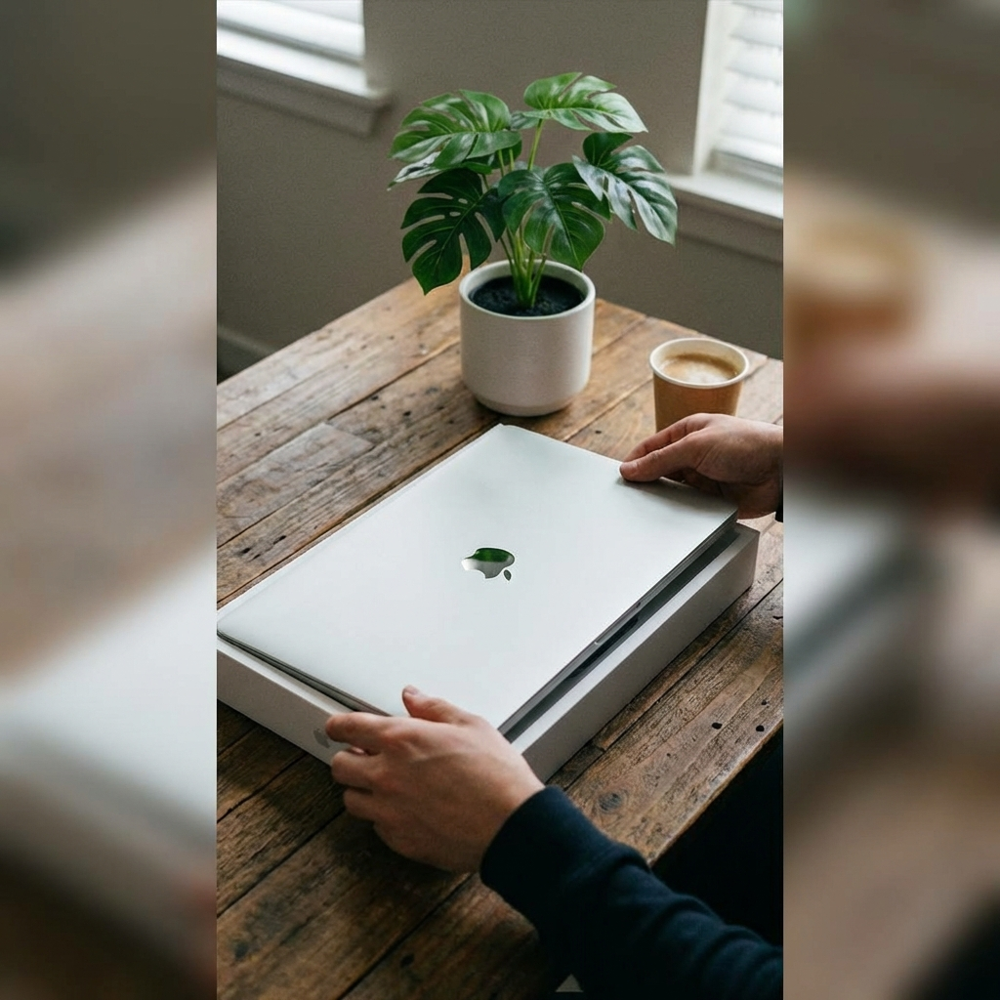
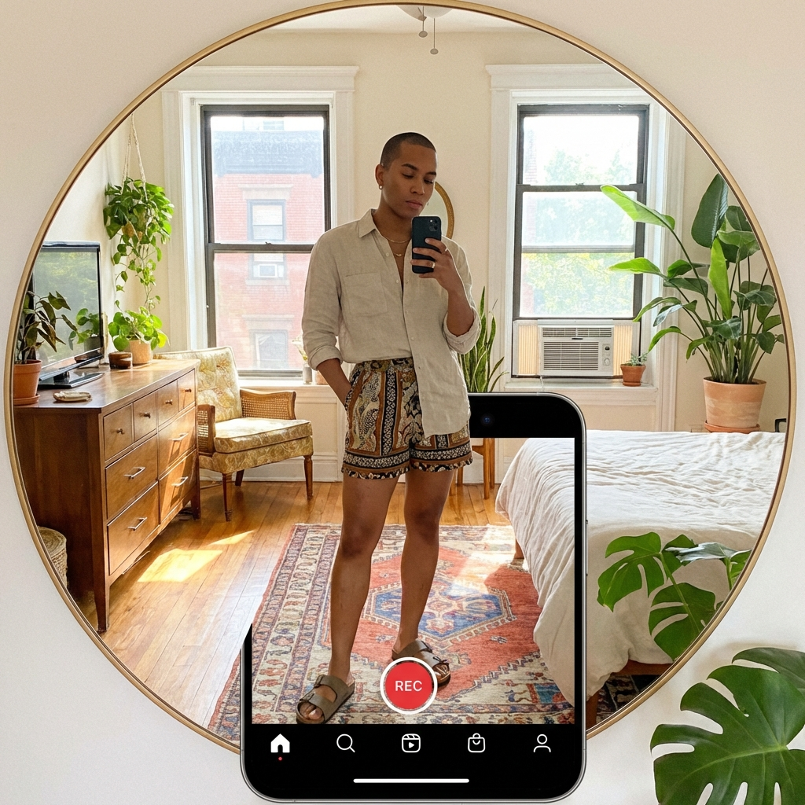
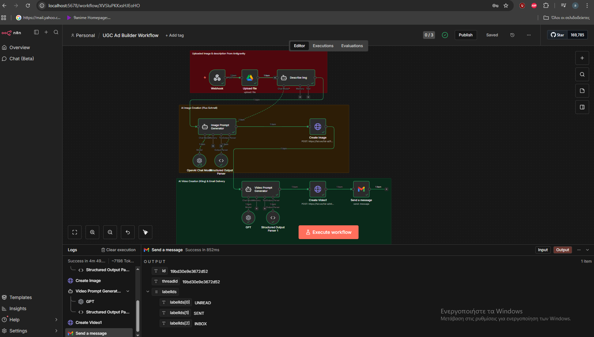

<p align="center">
  
  
  
  
  
</p>

<p align="center">
  
  
  
</p>

<h1 align="center">UGC Ad Builder</h1>

<p align="center">
  <strong>AI-powered UGC (User-Generated Content) ad creation platform</strong><br/>
  Upload your product images, define your ad concept, and receive a fully generated video ad via email.
</p>

<p align="center">
  <a href="https://ugc-creator-delta.vercel.app" target="_blank"><strong>View Live Demo</strong></a>
</p>

<p align="center">
  <a href="#-features">Features</a> •
  <a href="#-live-demo">Demo</a> •
  <a href="#-tech-stack">Tech Stack</a> •
  <a href="#-architecture">Architecture</a> •
  <a href="#-getting-started">Getting Started</a> •
  <a href="#-deployment">Deployment</a> •
  <a href="#-license">License</a>
</p>

---

## Overview

UGC Ad Builder is a full-stack application that automates the creation of User-Generated Content style video advertisements. The platform combines a modern React frontend with a powerful n8n workflow backend, leveraging multiple AI services to transform simple product images into engaging video ads.

**Key Highlights:**
- End-to-end automation from image upload to video delivery
- Integration with 5+ external APIs and services
- Production-ready deployment with Vercel and ngrok tunneling
- Clean, responsive UI with premium dark mode aesthetics

---

## Features

| Feature | Description |
|---------|-------------|
| **Drag & Drop Upload** | Intuitive file upload with real-time preview and validation |
| **Multi-Platform Support** | Optimized outputs for TikTok, Instagram Reels, YouTube Shorts, Facebook Ads |
| **AI Image Analysis** | Automatic product/character detection using OpenAI GPT-4o vision |
| **AI Image Generation** | Creates UGC-style images with Flux Schnell via Fal.ai |
| **AI Video Generation** | Transforms static images into dynamic videos using Kling Video |
| **Automated Email Delivery** | Receive finished video directly in your inbox via Gmail API |
| **Cloud Asset Storage** | Automatic backup of all uploads to Google Drive |
| **Premium UI/UX** | Dark mode, glassmorphism effects, smooth animations, mobile-responsive |

---

## Live Demo

**Production URL:** [https://ugc-creator-delta.vercel.app](https://ugc-creator-delta.vercel.app)

<p align="center">
  
  
  
</p>

<p align="center"><em>Sample AI-generated UGC ads for skincare, tech, and fashion products</em></p>

---

## Tech Stack

### Frontend
| Technology | Purpose |
|------------|---------|
|  | UI Framework with Hooks & Functional Components |
|  | Next-gen Build Tool & Dev Server |
|  | Custom styling with CSS Variables & Glassmorphism |
|  | Smooth animations & transitions |
|  | Modern icon library |

### Backend & Automation
| Technology | Purpose |
|------------|---------|
|  | Visual Workflow Automation Engine |
|  | Image Analysis & Intelligent Prompt Generation |
|  | Flux Schnell (Image) + Kling (Video) Generation |
|  | Cloud Asset Archival |
|  | Automated Video Delivery |

### DevOps & Infrastructure
| Technology | Purpose |
|------------|---------|
|  | Frontend Hosting & CI/CD |
|  | Secure Tunnel for Local n8n to Production |
|  | Version Control & Repository |

---

## Architecture

The application follows a modern JAMstack architecture with a decoupled frontend and webhook-based backend communication.

```
┌─────────────────────────────────────────────────────────────────────────────┐
│                                   USER                                       │
│                      Uploads Image + Defines Ad Concept                      │
└─────────────────────────────────────┬───────────────────────────────────────┘
                                      │
                                      ▼
┌─────────────────────────────────────────────────────────────────────────────┐
│                           REACT FRONTEND (Vercel)                            │
│  ┌───────────────┐  ┌───────────────┐  ┌─────────────────────────────────┐  │
│  │     Hero      │  │    Samples    │  │          BuilderForm            │  │
│  │   Component   │  │    Gallery    │  │   • Drag & Drop Image Upload    │  │
│  │               │  │               │  │   • Platform/Tone Selection     │  │
│  │   Animated    │  │   AI-Gen      │  │   • Email Input & Validation    │  │
│  │   Thumbnails  │  │   Examples    │  │   • Real-time Form Feedback     │  │
│  └───────────────┘  └───────────────┘  └─────────────────────────────────┘  │
└─────────────────────────────────────┬───────────────────────────────────────┘
                                      │ POST /webhook (multipart/form-data)
                                      ▼
┌─────────────────────────────────────────────────────────────────────────────┐
│                         NGROK SECURE TUNNEL                                  │
│                    Exposes local n8n to the internet                         │
└─────────────────────────────────────┬───────────────────────────────────────┘
                                      │
                                      ▼
┌─────────────────────────────────────────────────────────────────────────────┐
│                            N8N WORKFLOW ENGINE                               │
│                                                                              │
│  ┌────────────┐    ┌────────────────────────────────────────────────────┐   │
│  │  Webhook   │───▶│              PARALLEL PROCESSING                    │   │
│  │  Trigger   │    │  ┌──────────────┐      ┌──────────────────────┐    │   │
│  └────────────┘    │  │ Google Drive │      │   OpenAI GPT-4o      │    │   │
│                    │  │   (Archive)  │      │  (Image Analysis)    │    │   │
│                    │  └──────────────┘      └──────────┬───────────┘    │   │
│                    └───────────────────────────────────┼────────────────┘   │
│                                                        ▼                     │
│  ┌──────────────────────────────────────────────────────────────────────┐   │
│  │                    IMAGE GENERATION PIPELINE                          │   │
│  │  ┌──────────────────┐         ┌────────────────────────────────┐     │   │
│  │  │  OpenAI GPT-4o   │────────▶│    Fal.ai Flux Schnell         │     │   │
│  │  │  (Prompt Gen)    │         │    (Image Generation)          │     │   │
│  │  └──────────────────┘         └───────────────┬────────────────┘     │   │
│  └───────────────────────────────────────────────┼──────────────────────┘   │
│                                                  ▼                           │
│  ┌──────────────────────────────────────────────────────────────────────┐   │
│  │                    VIDEO GENERATION PIPELINE                          │   │
│  │  ┌──────────────────┐         ┌────────────────────────────────┐     │   │
│  │  │  OpenAI GPT-4o   │────────▶│    Fal.ai Kling Video          │     │   │
│  │  │  (Motion Prompt) │         │    (Image-to-Video)            │     │   │
│  │  └──────────────────┘         └───────────────┬────────────────┘     │   │
│  └───────────────────────────────────────────────┼──────────────────────┘   │
│                                                  ▼                           │
│  ┌──────────────────────────────────────────────────────────────────────┐   │
│  │                         GMAIL DELIVERY                                │   │
│  │                   Sends video URL to user's email                     │   │
│  └──────────────────────────────────────────────────────────────────────┘   │
└─────────────────────────────────────────────────────────────────────────────┘
```

### Data Flow
1. **User Interaction** → User uploads product image and configures ad parameters
2. **Form Submission** → Frontend sends multipart FormData to n8n webhook via ngrok tunnel
3. **Parallel Processing** → Image archived to Google Drive + analyzed by GPT-4o
4. **Image Generation** → AI creates UGC-style image prompt → Flux Schnell generates image
5. **Video Generation** → AI creates motion prompt → Kling Video animates the image
6. **Delivery** → Final video URL sent to user's email via Gmail API

---

## Project Structure

```
UGC-Ad-Builder/
│
├── frontend/                          # React + Vite Frontend Application
│   ├── src/
│   │   ├── components/
│   │   │   ├── Hero.jsx              # Landing section with animated thumbnails
│   │   │   ├── Samples.jsx           # Gallery of AI-generated examples
│   │   │   └── BuilderForm.jsx       # Main form with drag-drop & validation
│   │   ├── styles/
│   │   │   └── *.css                 # Component-specific styles
│   │   ├── App.jsx                   # Root component
│   │   ├── App.css                   # App-level styles
│   │   ├── index.css                 # Global styles & CSS variables
│   │   └── main.jsx                  # Application entry point
│   ├── public/
│   │   └── assets/                   # Static images (samples, thumbnails)
│   ├── .env                          # Environment variables
│   ├── package.json                  # Dependencies & scripts
│   ├── vite.config.js                # Vite configuration
│   └── index.html                    # HTML template
│
├── UGC Ad Builder Workflow.json      # n8n workflow (import this)
├── context.md                        # Detailed project documentation
├── CLAUDE.md                         # AI assistant guidelines
├── README.md                         # This file
└── LICENSE                           # MIT License
```

---

## Getting Started

### Prerequisites

| Requirement | Version | Purpose |
|-------------|---------|---------|
| Node.js | 18+ | JavaScript runtime |
| npm | 9+ | Package manager |
| n8n | Latest | Workflow automation |
| ngrok | Latest | Tunnel for webhooks |

### API Keys Required
- **OpenAI API** - For GPT-4o image analysis and prompt generation
- **Fal.ai API** - For Flux Schnell and Kling Video generation
- **Google Cloud** - OAuth credentials for Drive and Gmail

### Frontend Setup

```bash
# Clone the repository
git clone https://github.com/Aimilios94/UGC-Creator.git
cd UGC-Creator

# Navigate to frontend directory
cd frontend

# Install dependencies
npm install

# Create environment file
echo "VITE_N8N_WEBHOOK_URL=http://localhost:5678/webhook-test/ugc-ad-trigger" > .env

# Start development server
npm run dev
```

The frontend will be available at `http://localhost:5173`

### Backend Setup (n8n)

1. **Start n8n instance**
   ```bash
   npx n8n
   ```
   Open n8n at `http://localhost:5678`

2. **Import the workflow**
   - Go to Workflows → Import from File
   - Select `UGC Ad Builder Workflow.json`

#### n8n Workflow Preview

<p align="center">
  
</p>

<p align="center"><em>Visual workflow showing the complete ad generation pipeline in n8n</em></p>

**Workflow Stages:**
| Stage | Description |
|-------|-------------|
| **Input Processing** | Webhook receives image & form data, uploads to Google Drive |
| **Image Analysis** | GPT-4o analyzes the product/character in the uploaded image |
| **AI Image Creation** | Generates UGC-style prompt → Flux Schnell creates new image |
| **AI Video Creation** | Generates motion prompt → Kling Video animates the image |
| **Email Delivery** | Sends final video URL to user via Gmail |

3. **Configure credentials**
   | Credential | Setup |
   |------------|-------|
   | OpenAI API | Add your API key in n8n credentials |
   | Google Drive OAuth | Create OAuth app in Google Cloud Console |
   | Gmail OAuth | Same OAuth app, enable Gmail API |
   | Fal.ai API Key | Add as Header Auth credential |

4. **Activate the workflow**
   - Toggle the workflow to "Active"
   - Note the webhook URL for production use

### ngrok Setup (for Production)

```bash
# Install ngrok (if not installed)
# Download from https://ngrok.com/download

# Add your authtoken
ngrok config add-authtoken YOUR_AUTH_TOKEN

# Start tunnel to n8n
ngrok http 5678
```

Copy the generated URL (e.g., `https://xxxx.ngrok-free.app`) and update your Vercel environment variable.

---

## Deployment

### Frontend Deployment (Vercel)

1. **Push to GitHub**
   ```bash
   git add .
   git commit -m "Deploy to production"
   git push origin main
   ```

2. **Import to Vercel**
   - Go to [vercel.com](https://vercel.com) → Add New Project
   - Import your GitHub repository
   - Configure:
     - **Framework Preset**: Vite
     - **Root Directory**: `frontend`

3. **Set Environment Variables**
   - `VITE_N8N_WEBHOOK_URL` → Your ngrok URL + `/webhook/ugc-ad-trigger`

4. **Deploy**
   - Vercel auto-deploys on every push to main

### Backend Deployment Options

| Option | Pros | Cons |
|--------|------|------|
| **ngrok (Current)** | Free, easy setup | URL changes on restart |
| **ngrok Paid** | Static subdomain | Monthly cost |
| **n8n Cloud** | Fully managed, reliable | Subscription required |
| **Self-hosted VPS** | Full control, static URL | Requires server management |

---

## Design Principles

| Principle | Implementation |
|-----------|----------------|
| **Premium Aesthetics** | High contrast dark theme, generous whitespace, subtle gradients |
| **Glassmorphism** | Frosted glass effects with backdrop-blur and transparency |
| **Micro-interactions** | Hover states, smooth transitions, loading feedback |
| **Responsiveness** | Mobile-first CSS Grid layouts, fluid typography |
| **Accessibility** | Semantic HTML, focus states, sufficient color contrast |

---

## API Reference

### Webhook Endpoint

| Property | Value |
|----------|-------|
| **URL** | `{base_url}/webhook/ugc-ad-trigger` |
| **Method** | `POST` |
| **Content-Type** | `multipart/form-data` |

### Request Parameters

| Field | Type | Required | Description |
|-------|------|----------|-------------|
| `image` | File | Yes | Product image (PNG, JPG, WebP) |
| `email` | String | Yes | Delivery email address |
| `description` | String | Yes | Product description & ad concept |
| `platform` | String | Yes | `tiktok` \| `instagram` \| `youtube` \| `facebook` |
| `tone` | String | Yes | `energetic` \| `calm` \| `professional` \| `playful` |
| `ratio` | String | Yes | `9:16` \| `1:1` \| `16:9` |

### Response

| Status | Description |
|--------|-------------|
| `200 OK` | Request accepted, processing started |
| `400 Bad Request` | Invalid or missing parameters |
| `500 Error` | Server/workflow error |

---

## Roadmap

- [ ] Multiple image upload support
- [ ] Real-time video preview before email delivery
- [ ] Custom branding/watermark options
- [ ] Template library for different industries
- [ ] User dashboard with generation history
- [ ] Analytics and usage tracking
- [ ] A/B testing for ad variations

---

## Contributing

Contributions are welcome! Please feel free to submit a Pull Request.

1. Fork the repository
2. Create your feature branch (`git checkout -b feature/AmazingFeature`)
3. Commit your changes (`git commit -m 'Add some AmazingFeature'`)
4. Push to the branch (`git push origin feature/AmazingFeature`)
5. Open a Pull Request

---

## License

This project is licensed under the MIT License - see the [LICENSE](LICENSE) file for details.

---

## Acknowledgments

- [OpenAI](https://openai.com) for GPT-4o vision and language models
- [Fal.ai](https://fal.ai) for Flux Schnell and Kling Video APIs
- [n8n](https://n8n.io) for the powerful workflow automation platform
- [Vercel](https://vercel.com) for seamless frontend deployment
- [ngrok](https://ngrok.com) for secure tunneling solution

---

<p align="center">
  <strong>Built with modern technologies and AI-powered automation</strong><br/>
  <a href="https://github.com/Aimilios94">@Aimilios94</a>
</p>
